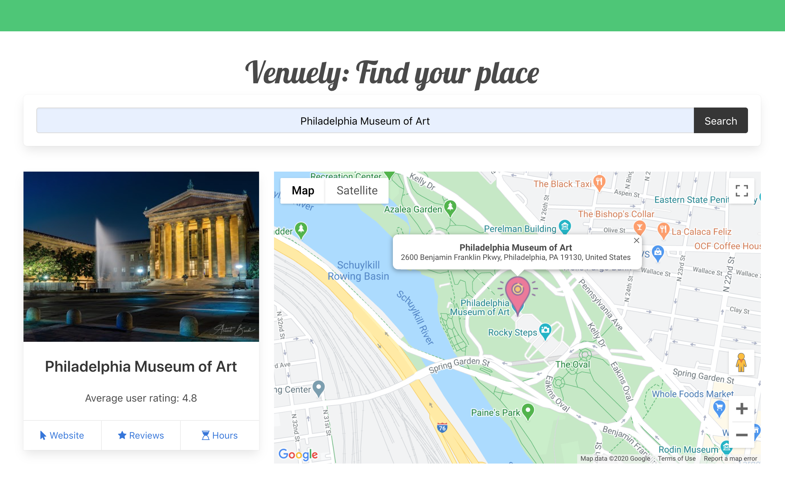
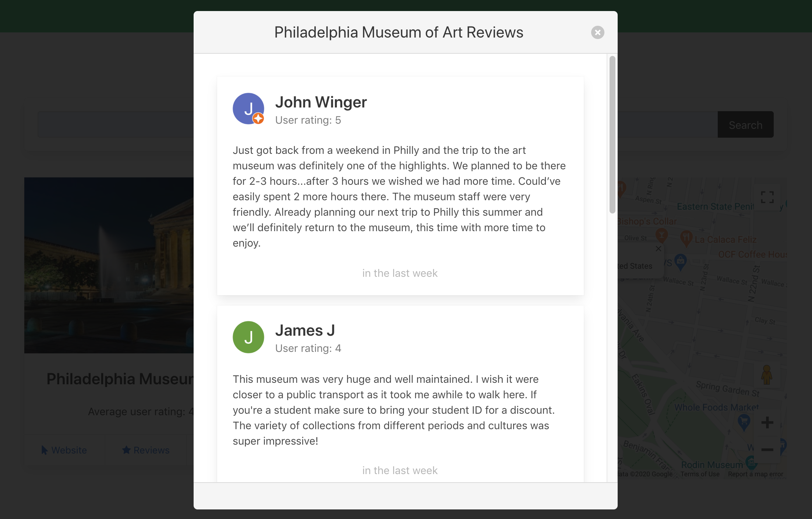
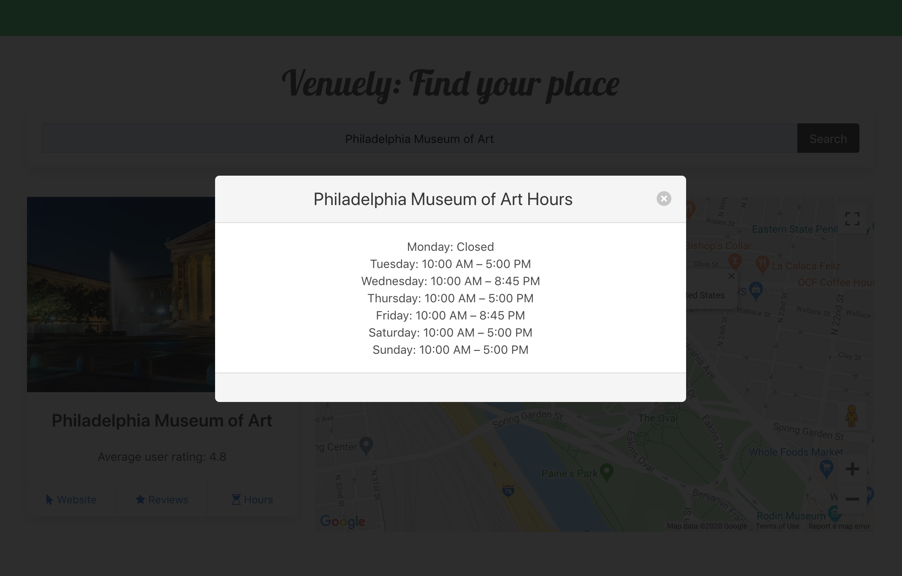
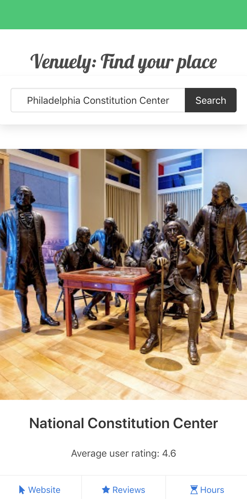
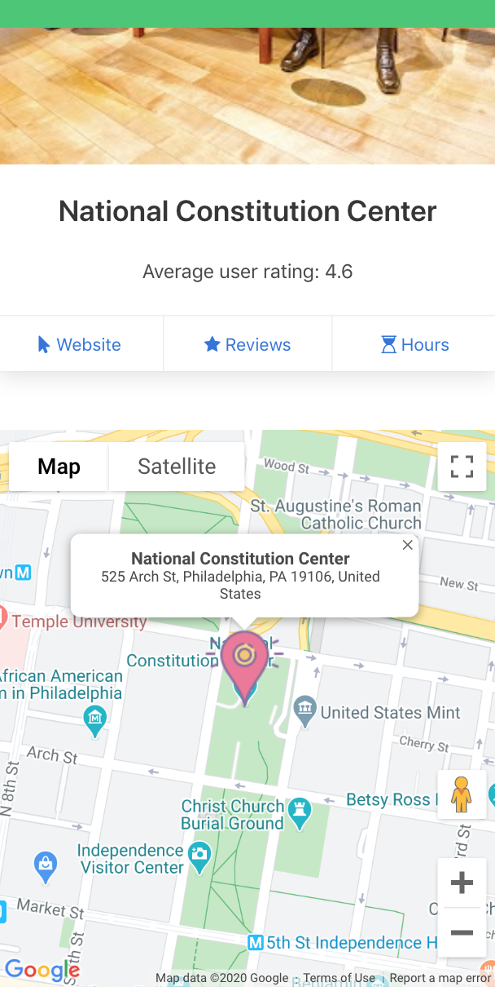
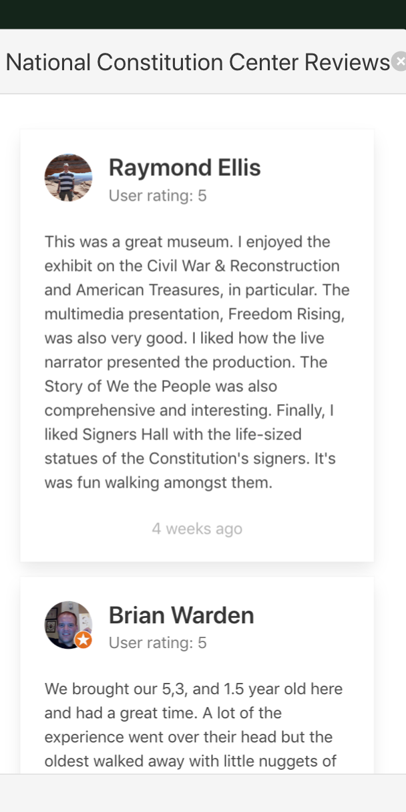

# Venuely 

> A simple web app to find all the information for your next stop </br>

**Problem**: Sometimes we just want a quick, centralized snapshot of a venue's location, hours, reviews, and contact information, rather than being bombarded with a dozen different links leading to different webpages or having to pull up Google Maps to visualize a venue's location.  

**Solution**: Trying to plan a weekend? Have a spot in mind? Enter Venuely, an app that searches for venues and finds it's location, contact information, reviews, hours, and website, all in one place. This app is meant for people who know what venues they'd like to search, rather than a discovery tool for new spots. This web app was a front-end project and was built with React, Bulma, and Google APIs, among other technologies. 

### Technical Decisions 

The app uses React, Bulma, Axios, Axios, Create React App, and a few Google APIs. Below is my rationale behind my technical choices: 

**React**: There are two ways I would have approached the front-end. The first approach would have involved HTML5, CSS3, and JavaScript/jQuery, but I elected to use React for a few reasons. First, this app requires making several API calls, and in my experience, React handles dynamic loading better than vanillas JavaScript / jQuery, which often requires a page reload to supply new information to the user, whether by way of an API call or database query. These page reloads lead to a perceivable "flash" and glitchiness which negatively impacts user experience. React, by contract, handles asyncronicity with grace, loading components as they are ready by way of careful state management. It is in this way that React allows you to limit the impact that unrelated page elements have on one other (e.g., there's no reason the navbar or searchbar should be reloading if the search result will be displayed in a separate card below). Another reason I chose React is that ternary operators allow for clean and easy error handling in the event that a componenet doesn't load or an API call fails. Components take time to flesh out, but in the long run, the reusability and dynamism of such components pays off in dividends, especially as an app grows larger and more complex. 

**Bulma**: There are a host of CSS frameworks out there, but I chose Bulma over vanilla CSS and Bootstrap (as well as many other frameworks) with a few design reasons in mind. To start, Bulma is a lightweight, JavaScript-free framework that offers minimalist interface elements, making it easy to get started quickly. Other frameworks, like Bootstrap, offer too many interface choices and embed pre-built jQuery/JS with interactive elements, like modals. With Bulma, although building interactivity takes a bit more work, you have greater control over its behavior and you avoid unintended side-effects that can come with interactive elements. Second, Bulma offers a minimalist and modern aesthetic that stands in contrast to some of the more familiar frameworks (e.g., Material UI, Bootstrap). This means your UI can look clean, simple, and refreshingly new. Third, in today's world, the majority of web traffic is now mobile, so ensuring responsivness needs to be top of mind no matter the app. Bulma was built as mobile-first framework, simplifying or altogether eliminating the need for media queries and other styling adaptations and allowing you to approach design from mobile to desktop, rather than the reverse.  

Another option, of course, would have been to use CSS Grid and Flexbox (in combination, as they're more powerful together). But when time is at premium, a lightweight CSS framework saves you the hassle of custom styling while still allowing you to override styles as needed. 

**Axios**: This popular NPM package offers a simple, promised-based HTTP client. It is widely supported across browsers, ensuring backwards compatibility, and easy to use. Alternatives to axios include jQuery and Fetch, but Axios is commonly paired with React and returns objects from API calls. In summary, I chose Axios for its ease of use, documentation, robustness, and its native ability to rely on promises. 

**Create-React-App**: My decision to use this was made simple. The ease of starting a new project quickly and painlessly explains my use of Create React App, as the documentation itself says that it is meant for single page web apps (or in general, simple projects). 

**Google Places API**: The Google Places API includes several endpoints depending on the kind of information you're looking to incorporate. In the case of Venuely, an API call to the standard Google Places API (Place Search) is made, followed by another call to the Place Details endpoint for "details" on the location using the Place ID retrieved from the first call. Yelp, as well as a few other APIs, can also fetch details, reviews, and contact information for a venue, but I chose to use the Google Places API because I knew combining APIs from the same platform would be cleaner and simpler, especially as data formats (with coordinates, for example) are standardized and cross-compatible. 

**Google Maps API**: There are few maps APIs out there, but I went with Google for a few reasons. First, the Google Maps API is the most widely used of all Maps APIs, and so it comes armed with an active, vibrant community and extensive resources by way of documentation and stack overflow questions. Second, I was familiar with the Google Maps API as I had used it before, so getting it up and running would be simpler than if I used a different Map product, like OpenStreetMap. Third, the response format and information hierarchy mirrors the response format of the Google Places API, so staggering API calls would be simpler than if I received coordinates and other information in different formats that required conversion. Fourth, the Maps API comes with other endpoints, like the Geocoder endpoint, to fetch coordinates from addresses or address queries, and so building out additional web app geolocation / map functionality would be much simpler.


### Demo

If you'd like to try Venuely yourself, visit the live verison here(). Choose a specific place, whether restaurant, museum, landmark, park, or store, and enter it into the search bar. Here are a few good ones to start off: 

```
Philadelphia Museum of Art
```

```
National Constitution Center
```

#### Image 1: 


#### Image 2: 


#### Image 3:


### Venuely is also completely mobile and tablet-responsive: 

#### Image 1: 


#### Image 2: 


#### Image 3: 



Check out the video demo [here](https://drive.google.com/file/d/1KvDa_pFXtCG0XyVVIg6Pxb8J23o-HZR4/view). 

### Lessons Learned 

**Branching**: I didn't branch, but I should have. Had I time to do this project over, I likely would have created branches for each feature / bug fix, and named them appropriately. I would then merge those branches into a another development branch (branched off from master), rather than working off of master directly. Once a feature or bug fix is finished, I'd then merge into the develop branch and finally into master (the latter used only for release). 

**API Troubleshooting**: Working with the Google Places API ended up being rather time consuming, as making calls to the API required using a CORS proxy, which added Access-Control-Allow-Origin to the response header. I ended up referencing [this](https://stackoverflow.com/questions/43871637/no-access-control-allow-origin-header-is-present-on-the-requested-resource-whe/43881141#43881141) Stack Overflow response extensively for a workaround and to understand the genesis of the problem. 

### Areas for further development

Next steps and a few areas of further development include: 
* Displaying an interactive carousel of images using the Google Place Photos API
* Recommending related venues based on user search 
* Incorporating redirects to user profiles from reviewers  
* Allowing users to save searches and pin venues to their "favorites" (would require building out the backend)
* Integrating authentication 

### This project was built with...
* HTML5
* CSS3
* JavaScript
* [Create React App](https://reactjs.org/docs/create-a-new-react-app.html)
* [Bulma](https://bulma.io/)
* [React-router-dom](https://www.npmjs.com/package/react-router-dom)
* [Axios](https://www.npmjs.com/package/axios)
* [Node.js](https://nodejs.org/en/) 

### ... and the following APIs / endpoints 

* [Google Places API](https://developers.google.com/places/web-service/intro)
* [Google Place Search](https://developers.google.com/places/web-service/search)
* [Google Place Details](https://developers.google.com/places/web-service/details)
* [Google Place Photo](https://developers.google.com/places/web-service/photos)
* [Google Maps JavaScript API](https://developers.google.com/maps/documentation/javascript/tutorial)

### Attributions 
* [Google Fonts](https://fonts.google.com/)
* [Map Marker](https://icons8.com/)

## Author

**Tomas Gear:** [Github](https://github.com/nexio-t) | [Portfolio](http://www.tomas-gear.com)

